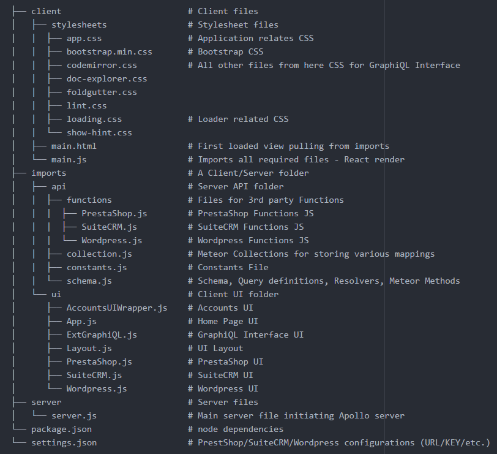

# KaTaNa Stack

A simple stack to kick-start integrating Apollo(GraphQL), Meteor and React with eCommerce applications like PrestaShop/SuiteCRM/Wordpress.

## Basic Requirements
- PrestaShop/SuiteCRM/Wordpress vanilla installations can be done on separate/same server as per your requirement.
- Similarly, this project can be deployed as a Meteor application.
- All you need to do is configure and connect the above systems together by using `settings.json`.  
Refer the [Configurations/Changes](#configurationschanges) section for more details.

## Includes
- Apollo server
- Apollo client
- React
- Accounts UI, Basic & password
- ES6 syntax
- PrestaShop/SuiteCRM/Wordpress basic configurations, schema and resolvers


## Running the application

```
meteor npm install
meteor --settings settings.json
```

## Folder structure



## Configurations/Changes
### 1. PrestaShop
##### Under settings.json, modify the following
* `PRESTA_API_URL` : PrestaShop REST URL
* `PRESTA_KEY` : PrestaShop Basic Authentication Key for accessing the REST services.
* `PRESTA_PDF_LINK` : Modify just the hostname here with PrestaShop hostname.

##### Navigate the PrestaShop Admin-UI
Remove all the discounts applicable for different products as currently the application is not able to handle discounts.

##### Changes for enabling PDF generation without authentication  
###### NOTE: This step is required else PDF generation will not happen as it requires authentication being a default behavior.
- Open the file `PrestaShop_App_Location/apps/prestashop/htdocs/controllers/front/PdfInvoiceController.php`.  
NOTE: If it is a bitnami installation, then `PrestaShop_App_Location = ~/stack`.
- Comment the line `Tools::redirect('index.php?controller=authentication&back=pdf-invoice');`
- Save the file, PDF generation should work fine now.

### 2. SuiteCRM
##### Under settings.json, modify the following
* `SUGAR_API_URL` - SuiteCRM REST URL, Example: `SuiteCRM_Url`/service/v4_1/rest.php
* `SUGAR_USERNAME` - SuiteCRM Admin Username
* `SUGAR_PASSWORD` - SuiteCRM Admin Password

### 3. Wordpress
##### Under settings.json, modify the below two properties
* `WP_API_URL` is the REST API URL of the Wordpress application.
* `WP_NO_IMAGE_LINK` is the location of the media link for No-Image.  
Image Location can be found by just clicking on the image under `Media section` and capture the `URL value`.  
Example: http://`wordpress-hostname`/wp-content/uploads/2016/10/No-image-found.jpg

##### Navigate the Wordpress Admin UI
- Under `Plugins section`, add the plugin - `WordPress REST API` (Version 2) [WP REST API | Version 2.0-beta13.1 | By WP REST API Team]
- Under `Pages section`, add pages for corresponding PrestaShop Categories
- Under `Media section`, upload the required Images for corresponding PrestaShop Products

### 4. Mapping Prestashop (Categories and Products) with Wordpress (pages and media)
##### Access/Enable the `Admin Tab` in Navigation/Menu Bar
###### Regiter as `admin` user
In the Navigation/Menu Bar, `click Sign-In`  
A pop-up will open, click `Create account` link  
Enter Username, Password and Password (again). NOTE: Username should be `admin` only.  
Click `Create account` button  
Your account will be created successfully and you will automatically logged in  
Now you should be able to see `Admin Tab` in the Navigation/Menu Bar
###### Manage Mappings under `Admin Tab` in Navigation/Menu Bar
Here you can see separate sections to create/update the Category and Product Mappings  
- Category Mapping  
Click Edit against any PrestaShop Category row, a textbox will appear  
Enter the Wordpress Page ID (This can be obtained using the REST service of Wordpress) and click Save  
You should now be able to see the Wordpress content when you navigate to PrestaShop Page and select the category
- Product Mapping  
Click Edit against any PrestaShop Product row, a textbox will appear  
Enter the Wordpress Image Link (This can be obtained using Wordpress Admin UI under Media section)and click Save  
You should now be able to see the Wordpress Images against the respective products when you navigate to PrestaShop Page and select the category
